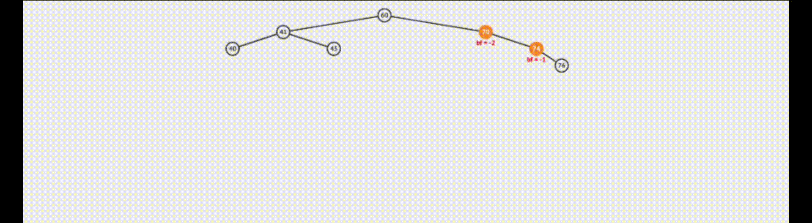
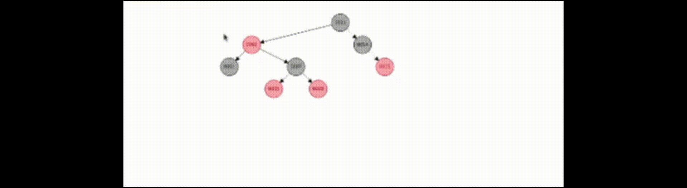

# Relatorio comparação de arvores:

De acordo com a proposta apresentada pelo professor teriamos que comparar 3 tipos de estruturas de árvores diferentes com 4 entradas diferentes.

## Estrutura de arvores:

### Arvore Binaria:
Considere uma arvore binaria cujos os nos admitem comparação.
Supondo que os nos são do tipo inteiro, e as entradas são (5,4,7,9,6), temos essa estrutura:  
         <p align="center">
         <br/>
         </p>

- Observe que a comparação ocorre no momento da inserção, numeros menores que a raiz(5) vão para subárvore esquerda e maiores para subárvore direita, usamos o mesmo raciociono para os demais nós.

### Arvore AVL 
Esta estrutura veio para corrigir um problema encontrado na arvore binaria, onde, seu desempenho pode ser afetado pela forma com que o conjunto é apresentado para o metodo de inserção da arvore.
Para solucionar esse problema gereamos oque chamamos de balanciado da arvore.

- O balenciamento se consiste em manter as subarvores esquerda e direita com uma altura aproximada.
- O algoritmo identifica subarvores desbalanciadas quando as alturas de suas subarvores diferencia em uma unidade.
     <p align="center">
     <br/>
     </p>
        
- O balenciamento da arvore avl se da por meio de rotações.
    - Rotação simples para direita:
         <p align="center">
         <br/>
         </p>
    - Rotação simples para esquerda:
    <p align="center">
    <br/>
    </p>    
    - Rotação dupla para direita:
    <p align="center">
    <br/>
    </p>
    - Rotação dupla para esquerda:
    <p align="center">
    <br/>
    </p>


### Arvore Red Black:
A estrutura de arvore conhecida como "red black" esta dentro do grupo de estruturas de arvores balanciadas.
Esta estrutura usa um metodo de restrição de suas inserções pela coloração de seus nós, esta estrutura garante que nem um de seus caminhos tera comprimento maior que duas vezes o comprimento de qualquer outro caminho.

- Os nós adquirem a cor vermelho ou preto.
- A raiz sempre sera preta.
- Os filhos dos nós folhas(null) são pretos.
- Um nó é vermelho seus vizinho são pretos. 
- O caminho para qualquer nó apresenta o mesmo numero de nos pretos. 
- Todo novo nó inserido começa vermelho.

- O balanciamento das subarvore de uma arvore redblack se é dado na hora da inserção e pode varias em 3 casos:
    - Caso 1: A inserção de um nó vermelho deve GARANTIR que seu pai e tio sejam pretos.
        - Correção: Faça o pai e o tio se tornarem pretos, o novo item na recursão (i.e., pai do pai) se torna vermelho. Reorganize os ponteiros um nível acima.
    - Caso 2: O tio de um item é preto, o item e seu pai são vermelhos e o item é o filho da direita.
        - Correção: Rotação para a esquerda a partir da posição do pai e do item.
    - Caso 3: O tio do item é preto, o item e seu pai são vermelhos e o item é o filho da esquerda.
        - Correção: Modifique a cor do item do nível acima (11) e gere uma rotação a direita.

 <p align="center">
    <br/>
    </p>


- A remoção de um item pode gerar o um total de 5 casos sendo sendo que o caso 4 se divide em mais 4 casos:
- Caso 1: O nó a ser removido é vermelho e possui apenas um único filho ou não possui filhos.
    - Correção: Remoção análoga ao de uma árvore binária comum.
- Caso 2: O nó a ser removido é vermelho e seu sucessor também é vermelho
    - Correção: Remoção análoga ao de uma árvore binária comum.
- Caso 3: O nó a ser removido é preto e seu sucessor é vermelho
    - Correção: Remova o nó, substitua pelo sucessor e pinte o sucessor de preto.
- Caso 4: O nó a ser removido e seu sucessor são pretos(doble black):
    - Considere:
    - z: O nó a ser removido.
    - y: o sucessor de z.
    - x: O filho do sucessor antes de qualquer modificação.
    - w: O irmão de x antes da remoção de z.
    - Caso 4.1: O irmão w de x é vermelho.
        - Correção: rocar as cores de w e x.pai e realizar rotação à esquerda tendo como ponto de observação x.pai.
    - Caso 4.2: O irmão w de x é preto e ambos os filhos de w são pretos.
        - Correção: Atualizamos w para vermelho, atualizamos x levando-o para o se pai e repetimos o processo a partir do novo x.
    - Caso 4.3:  O irmão w de x é preto, o filho esquerdo de w é vermelho e o da direita preto.
        - Correção: Troca-se a cor de w e de seu filho esquerdo, rotaciona a árvore para a direita usando como pivô w e neste ponto, o novo irmão wde x é preto com o filho da direita na cor vermelha, o que nos leva ao caso 4.4.
    - Caso 4.4: O irmão w de x é preto e o filho direito de w é vermelho.
        - Correção: Rotaciona a árvore para a esquerda usando como pivô x.pai, w é pintado com a cor de x.pai, x.pai é pintado de preto e pintar o filho direito de w de preto.


## Codificação:

### Arquivos utilizados

 <table>
        <thead>
        <tr><th colaspan="4">Arquivos</th></tr>
        </thead>
        <tbody>
        <tr>
        <td>Arquivos.txt:</td>
        <td>Arquivos.hpp:</td>
        <td>Arquivos.cpp:</td>
        </tr>
        <tr>
        <td>500_num.txt</td>
        <td>all_tree.hpp</td>
        <td>all_tree.cpp</td>
        </tr>
        <tr>
        <td>5000_num.txt</td>
        <td>compar_tree.hpp</td>
        <td>compar_tree.cpp</td>
        </tr>
        <tr>
        <td>50000_num.txt</td>
        <td>fila.hpp</td>
        <td>fila.cpp</td>
        </tr>
        <tr>
        <td>500000_num.txt</td>
        <td>prep_doc.hpp</td>
        <td>prep_doc.cpp</td>
        </tr>
        <tr>
        <td>search.txt</td>
        <td>-------</td>
        <td>avl_tree.cpp</td>
        </tr>
        <td>RemoçãoAVL.txt</td>
        <td>-------</td>
        <td>b_tree.cpp</td>
        </tr>
        <td>Remoção_binaria.txt</td>
        <td>-------</td>
        <td>r.b_tree.cpp</td>
        </tr>
        <td>Remoção_rb.txt</td>
        <td>-------</td>
        <td>-------</td>
        </tr>
</table>


### Metodo de incerção e remoção:
  
  Os metodos de inserção e remoção foram baseados no livro "T. Cormen, E. Leiserson, R. L.Rivest, C. Stein. Algoritmos: Teoria e Prática".


## Resultado e analise:

Utilizando métodos de inserção e remoção apresentados no livro() fizemos a comparação das estruturas apresentadas, 500, 5000, 50000 e 500000.


Priemiramente vamos analisar o resultada das inserções nos estrutura de arvore e no vector:


  <p align="center">
         <br/>
         </p>
(1.1)


 <p align="center">
         <br/>
         </p>

(1.2)

- Utilizando de mais comparações podemos ver quando as estruturas de arvore binaria e de arvore AVL começeam a perder eficiencia dependendo do numero e inseções em relação a arvore red black
Na figurar "1.1" retiramos o vector devido seu diferenção descrepante para as demais estruturas.
Observe na figura "1.2" esta fiferença.

Observe abaixo a comparação das estrutras `map` e `unordered_map` com as arvores red black e avl:


<p align="center">
         <br/>
         </p>

- Observe a similaridade dos tempos entre as estruturas, isto se deve ao fato que as estruturas ```map``` e `unordered_map` são estrutuas de arvores red black e avl respequitivamente. Ainda sim as estruturas de arvore conseguiram um maior desempenho.


**Após relizarmos todas as inserções vamos analisar as remoções em cada estrutura:**


<p align="center">
         <br/>
         </p>
(2.1)

- Podemos observar que em relação a pesquisa e remoção a arvore binaria é a estrutura que encontra mais dificuldade. Isto se da devio ao fato desta estrutura não ser balanciada.

- Observe tambem na figura "2.1" a falata de linearidade do grafico de remoção, isto se da devido a variação da massa de dados que pode alaterar a eficienca de uma estrutura. Discutiremos mais sobre mais abaixo. 

<p align="center">
         <br/>
         </p>
(2.2)

- Podemos observar que as estrturas de arvore levaram grande vantagem em relação as estruturas `unordered_map` e `map`.


**Vamos analisar agora como a massa de dados pode pejudicar a eficiencia de um algoritmo:**

**Analizando a massa de dados:**
Masssa de dados 1:

```
Foram removidos :6 na arvore AVL.
Não foram encontrados:9934 na arvore AVL.
Foram removidos :6 na arvore binaria.
Não foram encontrados:9934 na arvore binario.
Foram removidos :6 na arvore red black..
Não foram encontrados:9934 na arvore red black.

```
Masssa de dados 2:

```
Foram removidos :1167 na arvore AVL.
Não foram encontrados:8677 na arvore AVL.
Foram removidos :1167 na arvore binaria.
Não foram encontrados:8677 na arvore binaria
Foram removidos :1167 na arvore red black.
Não foram encontrados:8677 na arvore red black.
```


<p align="center">
         <br/>
         </p>

- Observe que na **massa de dodos 1** foram encontrados apenas 6 numeros, ja na **massa de dados 2** o numero aumentou mais de 195 vezes. Isso significa que a estrutura precisou chegar ate o fim dela uma quantidade de vezes menor otimizando assim sua eficiencia. 

### Caracteristicas e compilação:

<table>
  <thead>
        <tr><th colaspan="10">Caracteristicas do computador</th></tr>
        </thead>
        <tbody>
        <tr>
        <td>processador</td>
        <td>Intel® Core™ i5-8265U</td>
        </tr>
        <tr>
        <td>Memoria ram</td>
        <td>7,6 GiB</td>
        </tr>
        <td>Sostema operacional</td>
        <td>Ubuntu 20.04.5 LTS</td>
        </tr>
</table>


<table>
  <thead>
        <tr><th colaspan="10">Compilação</th></tr>
        </thead>
        <tbody>
        <tr>
        <td>make</td>
        <td>compila os arquivos</td>
        </tr>
        <tr>
        <td>make run</td>
        <td>executa o codigo</td>
        </tr>
</table>
- Ao iniciar o codigo primeiramente você deve escolher uma entre a 6 opções indicadas na tela.
